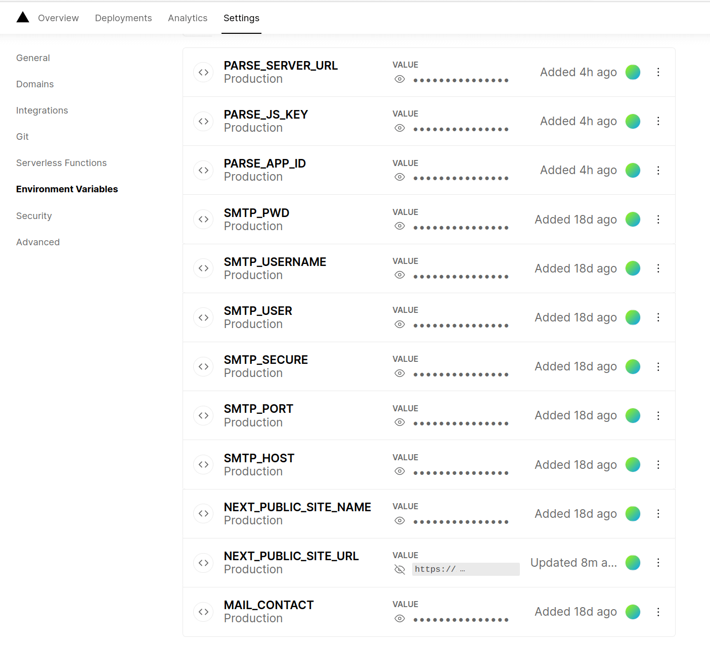

# A Next.js dashboard starter with Material-UI and Parse SDK

## How to setup

### 1. Download the sources

Download the zip file from the [github repo](https://github.com/zipang/parse-materia-dashboard-next) and unzip it.

Or with [degit](https://github.com/Rich-Harris/degit) : 
```sh
degit zipang/parse-materia-dashboard-next my-dashboard
cd my-dashboard
```

Install the dependencies :

```sh
yarn
```

### 2. Create your Parse backend with back4app

[Create an application](https://youtu.be/JWMv2aEx5G0), 
Create the following Classes with the following fields : 
Adherent
Adhesion
Parameters

### 3. Create the local parameters

Next.js makes it super easy to [load project environnement variables from `.env` files](https://nextjs.org/docs/basic-features/environment-variables)

```sh
cp .env.local.sample .env.local
nano .env.local
```

This `env` file which should now contain something like this with the values of your Parse backend, as well as the configuration of the mail server and the site name and URL.. :

```properties
NEXT_PUBLIC_SITE_URL=https://my.dashboard.wtf
NEXT_PUBLIC_SITE_NAME=DASHBOARD ADHESIONS
PARSE_APP_ID=XXXXXXXXXXXXXXXXXXXXXXXXXXXXXXXXXXXXXXXX
PARSE_JS_KEY=XXXXXXXXXXXXXXXXXXXXXXXXXXXXXXXXXXXXXXXX
PARSE_SERVER_URL=https://parseapi.back4app.com
SMTP_HOST=smtp.server.com
SMTP_PORT=587
SMTP_SECURE=false
SMTP_USER=contact@somewhere.org
SMTP_USERNAME=CONTACT DASHBOARD
SMTP_PWD=XXXXXXXXXXXXXXXXX
MAIL_CONTACT=CONTACT DASHBOARD <contact@somewhere.org>
```

Note : be sure that this local environment file is never pushed to git as it contains sensible informations.

To have these environment variables available in Vercel (the prefered choice for our deployments) you have to create the manually in the environment variables sections :



